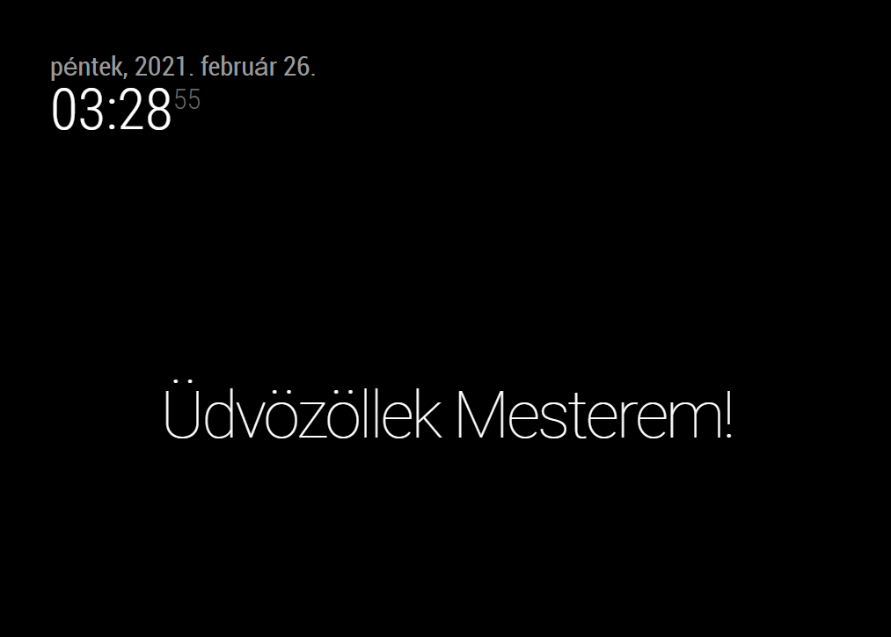
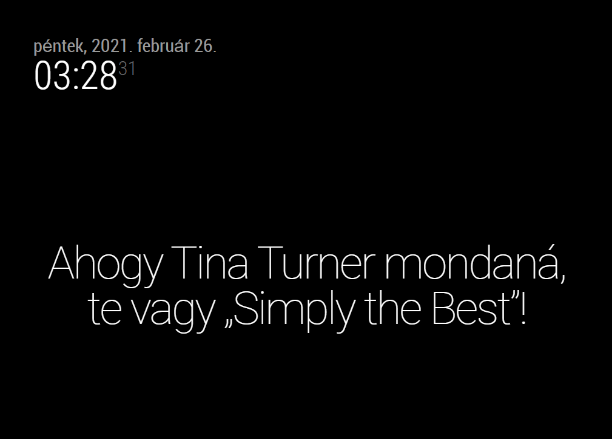

# MMM-Udvaronc

This is a module for the [MagicMirror²](https://github.com/MichMich/MagicMirror/) to display Hungarian compliments from [Udvaronc](https://udvaronc.hu).

## Screenshot

Default bow:



Long compliment:



For updates, please check the [CHANGELOG](https://github.com/balassy/MMM-Udvaronc/blob/main/CHANGELOG.md).

## Using the module

To use this module follow these steps:

1. Clone this repository to the `modules` folder of your MagicMirror:

```bash
git clone https://github.com/balassy/MMM-Udvaronc.git
```

2. Add the following configuration block to the modules array in the `config/config.js` file:

```js
var config = {
  modules: [
    {
      module: 'MMM-Udvaronc',
      position: 'lower_third',
      config: {
        updateInterval: 3600000 // 1 hour in milliseconds
      }
    }
  ]
}
```

## Configuration options

| Option           | Description
|----------------- |-----------
| `updateInterval` | *Optional* The frequency of when the module should display a new compliment. <br><br>**Type:** `int` (milliseconds) <br>**Default value:** `3600000` milliseconds (1 hour)

## Contribution

Although for operation this module does not depend on any other module (other than the `request` module used by MagicMirror itself), if you would like to contribute to the codebase, please use the preconfigured linters to analyze the source code before sending a pull request. To run the linters follow these steps:

1. Install developer dependencies:

```bash
npm install
```

2. Run all linters:

```bash
npm run
```

## Got feedback?

Your feedback is more than welcome, please send your suggestions, feature requests or bug reports as [GitHub issues](https://github.com/balassy/MMM-Udvaronc/issues).

## Acknowledments

Many thanks to [Udvaronc](https://udvaronc.hu) for creating this service, opening it for other platforms and providing it for free.

## About the author

This project is created and maintaned by [György Balássy](https://www.linkedin.com/in/balassy).
